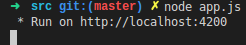

# 项目管理系统

​	这是一个简易的项目管理系统。支持简单的帐号注册登录

## 业务需求

   	1. 项目成员任务分配及查看功能
   	2. 项目组长查看项目总进度的功能
   	3. 任务提醒功能
   	4. 有一个+按钮，点了以后出一个框，选日期，填进度。写完，自动添加一条进度在表里
   	5. （未完成）导出为excel功能

## 安装

​	本系统假设运行在`ubuntu 16.04LTS`操作系统上，不考虑`windows`。

### 安装工具

​	需要安装`mysql` `nodejs`两个工具，这里提供两种方法，也可自行安装：

#### mysql

```shell
sudo apt-get update
sudo apt-get install mysql-server
```

#### nodejs

```shell
# use nvm to install
sudo apt-get install build-essential checkinstall
sudo apt-get install libssl-dev
sudo apt-get install curl
curl -o- https://raw.githubusercontent.com/creationix/nvm/v0.31.0/install.sh | bash
# close current terminal
# check if install nvm
command -v nvm

nvm install 8.0
nvm use 8.0
nvm alias default node
```

### 安装

​	直接从[github](git@github.com:hugoOrange/bigeye.git)下载即可

### 安装依赖包

​	需要安装的依赖可参见`src`目录下打`package.json`文件，安装：

```shell
# 进入到项目目录: ProjectManager
cd src
npm install express --save
npm install mysql --save
npm install express-session --save
npm install body-parser --save
```

### 安装一些其他组件

python连接mysql所用的库，用以运行`changePassword.py`文件，不影响正常服务器运行。

```shell
# 任意目录
sudo apt-get install libmysqlclient-dev libmysqld-dev python-dev python-setuptools
sudo apt-get install python-mysqldb
# 安装了pip的用户也可以用这条指令替代上一条指令
# pip install MySQL-python
```

### 数据库初始化

​	初始化文件为`项目目录/src/sql/init.sql`，直接在命令行下运行即可：

```shell
mysql -u username < /项目目录/ProjectManager/src/sql/init.sql -p
```

## 运行

​	在目录`/项目目录/src`下运行：`node app.js`，然后打开对应网址即可:



## 运行需知

- 注册，这里的注册都是需要邀请码的。首先，第一个用户(这里称为超级用户)，这是在运行`python init.py`之后就会有的(admin 123456)。在登录超级用户之后会看到邀请码，这里的邀请码就可以使用用来注册新帐号。另外，邀请码只有一次有效，在邀请码被使用掉（也就是使用该邀请码注册一次之后）就会失效，需要超级账户重新刷新生成邀请码。